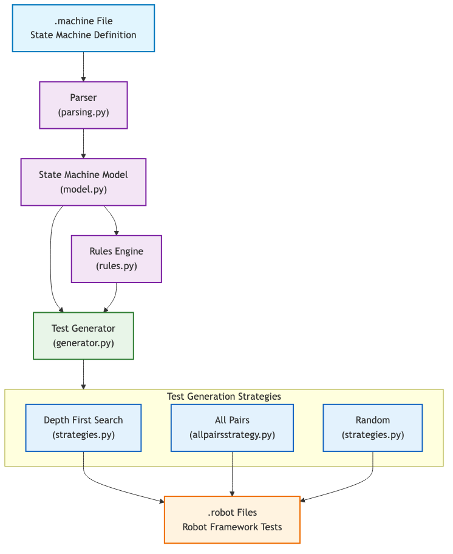
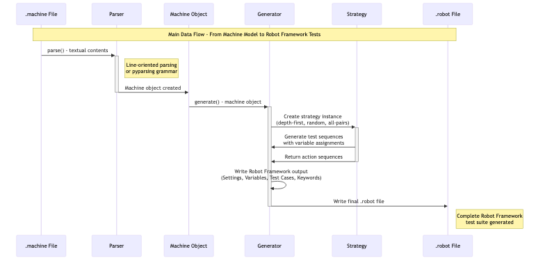

# FSM2Suites

A compact project demonstrating generation of test suites from finite-state machines (FSMs). The repository includes:

- an FSM-to-suite `generator/` with parsing and generation logic and unit tests;
- a small demo `backend/` (FastAPI) implementing an example shopping API;
- a `frontend/` (React + Vite) demo app showcasing the generated tests and API integration;
- the project report and diagram sources in `docs/report`.

**Highlights**

- FSM-based test-suite generation and strategies.
- End-to-end demo (frontend + backend) to validate generated suites.
- LaTeX report and diagrams documenting architecture and FSMs.


**Gallery**

A compact two-column preview of the two main diagrams used in the report:

<table>
	<tr>
		<td align="center">
			
			<div><strong>Architecture</strong></div>
		</td>
		<td align="center">
			
			<div><strong>Data Flow</strong></div>
		</td>
	</tr>
</table>

**Quick Demo (local)**

- Backend

```bash
cd backend
python -m venv .venv
source .venv/bin/activate
pip install -r requirements.txt
uvicorn main:app --reload --port 8000
```

- Frontend

```bash
cd frontend
npm install
npm run dev
```

- Generator (tests)

```bash
pip install -r generator/requirements.txt
pytest generator/tests
```

**Project Layout**

- `backend/` — FastAPI demo API and tests (`main.py`, `requirements.txt`).
- `frontend/` — React + Vite demo application and tests.
- `generator/` — FSM parsing, strategies and test-suite generation with unit tests.
- `docs/report/` — LaTeX report, bibliography and diagram sources.

Contributions, issues and suggestions are welcome — open a GitHub issue or a pull request. If you'd like, I can add rendered PNG previews of the diagrams to the README.


