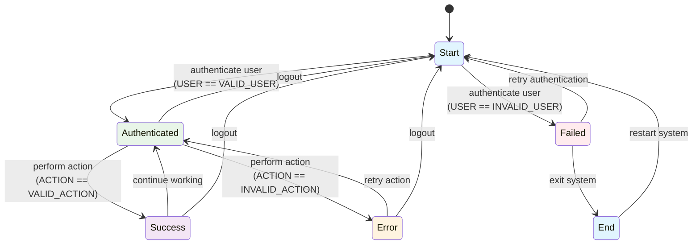
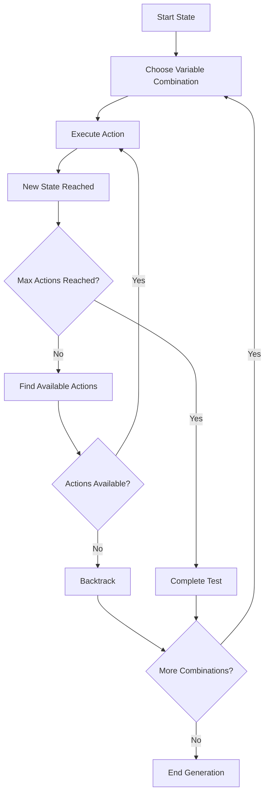
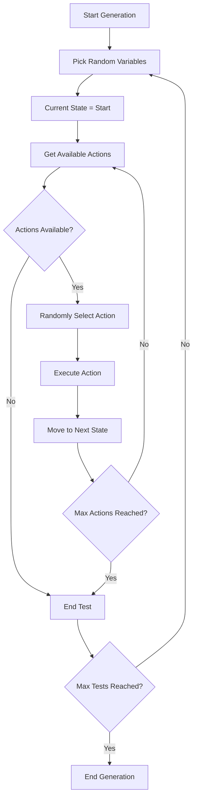
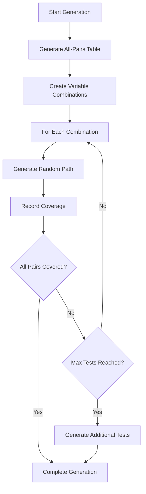
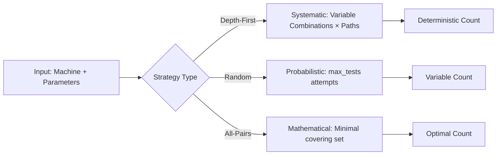

# Example Machine - Test Generation Strategies

This directory contains an example machine to demonstrate the three different test generation strategies available in the generator tool.

## Machine Description

The `example.machine` file contains a basic authentication and action workflow that includes:

- **States**: Start, Authenticated, Failed, Success, Error, End
- **Variables**: 
  - `${USER}` with values: `${VALID_USER}`, `${INVALID_USER}`
  - `${ACTION}` with values: `${VALID_ACTION}`, `${INVALID_ACTION}`

## State Machine Visualization



## Test Generation Strategies: Deep Dive

This section provides detailed explanations of how each strategy works internally, their algorithms, and the logic behind the generated test files.

### 1. Depth-First Search Strategy (`DepthFirstSearchStrategy`)

#### Algorithm Overview

The Depth-First Search strategy systematically explores the state machine by traversing as deep as possible along each branch before backtracking. It's essentially performing a graph traversal using DFS.



#### Internal Logic

```python
class DepthFirstSearchStrategy:
    def generate_tests(self, machine, max_tests, max_actions):
        tests = []
        # Generate all possible variable combinations
        var_combinations = self._get_all_variable_combinations(machine.variables)
        
        for combination in var_combinations:
            if len(tests) >= max_tests:
                break
                
            # For each combination, explore paths using DFS
            test_path = self._dfs_explore(machine, combination, max_actions)
            if test_path:
                tests.append(test_path)
        
        return tests
    
    def _dfs_explore(self, machine, variables, max_actions, current_state='Start', path=[]):
        if len(path) >= max_actions:
            return path
            
        # Get all possible actions from current state
        actions = machine.get_actions_for_state(current_state)
        
        for action in actions:
            # Check if action is valid with current variables
            if self._action_is_valid(action, variables):
                new_path = path + [action]
                next_state = machine.get_next_state(current_state, action, variables)
                
                # Recursively explore deeper
                result = self._dfs_explore(machine, variables, max_actions, next_state, new_path)
                if result:
                    return result
        
        return path  # Return current path if no deeper exploration possible
```

#### Generated Test Characteristics

- **Systematic Exploration**: Tests every possible variable combination systematically
- **Exhaustive Coverage**: Within the action limit, covers all reachable states
- **Deterministic Order**: Always generates tests in the same order
- **Path Completeness**: Each test explores as deep as possible before stopping

#### Example Generation Process

For our example machine with variables:
- `USER`: [`VALID_USER`, `INVALID_USER`]  
- `ACTION`: [`VALID_ACTION`, `INVALID_ACTION`]

**Step 1**: Combination (`VALID_USER`, `VALID_ACTION`)
```
Path: Start → authenticate user → Authenticated → perform action → Success → continue working → Authenticated
```

**Step 2**: Combination (`VALID_USER`, `INVALID_ACTION`)
```
Path: Start → authenticate user → Authenticated → perform action → Error → retry action → Authenticated
```

**Step 3**: Combination (`INVALID_USER`, `VALID_ACTION`)
```
Path: Start → authenticate user → Failed → retry authentication → Start
```

**Step 4**: Combination (`INVALID_USER`, `INVALID_ACTION`)
```
Path: Start → authenticate user → Failed → exit system → End
```

### 2. Random Strategy (`RandomStrategy`)

#### Algorithm Overview

The Random strategy generates test paths by making random decisions at each step, creating unpredictable but valid test sequences.



#### Internal Logic

```python
class RandomStrategy:
    def __init__(self, seed=None):
        self.random = random.Random(seed)
    
    def generate_tests(self, machine, max_tests, max_actions):
        tests = []
        
        for test_num in range(max_tests):
            # Randomly select variable values for this test
            variables = self._random_variable_combination(machine.variables)
            
            # Generate a random path
            test_path = self._random_walk(machine, variables, max_actions)
            
            if test_path:
                tests.append((variables, test_path))
        
        return tests
    
    def _random_walk(self, machine, variables, max_actions):
        path = []
        current_state = 'Start'
        
        for step in range(max_actions):
            # Get valid actions from current state
            valid_actions = machine.get_valid_actions(current_state, variables)
            
            if not valid_actions:
                break  # No more actions possible
            
            # Randomly choose an action
            action = self.random.choice(valid_actions)
            path.append(action)
            
            # Move to next state
            current_state = machine.get_next_state(current_state, action, variables)
            
            # Random chance to stop early (creates variable length tests)
            if self.random.random() < 0.1:  # 10% chance to stop
                break
        
        return path
```

#### Generated Test Characteristics

- **Unpredictable Paths**: Each run produces different test sequences
- **Variable Length**: Tests can be shorter or longer randomly
- **Quick Generation**: No need to explore all possibilities
- **Seeded Reproducibility**: Using a seed makes results reproducible

#### Example Generation Process

**Test 1** (Random variables: `INVALID_USER`, `VALID_ACTION`):
```
Random walk: Start → [authenticate user] → Failed → [randomly choose] → exit system → End
```

**Test 2** (Random variables: `VALID_USER`, `INVALID_ACTION`):
```
Random walk: Start → [authenticate user] → Authenticated → [perform action] → Error → [randomly choose] → logout → Start → [stop randomly]
```

**Test 3** (Random variables: `VALID_USER`, `VALID_ACTION`):
```
Random walk: Start → [authenticate user] → Authenticated → [randomly choose] → logout → Start → [stop early]
```

### 3. All-Pairs Random Strategy (`AllPairsRandomStrategy`)

#### Algorithm Overview

The All-Pairs strategy uses combinatorial testing to ensure all pairs of variable values are covered while minimizing the total number of tests.



#### All-Pairs Theory

For variables with values:
- `USER`: [`VALID_USER`, `INVALID_USER`]
- `ACTION`: [`VALID_ACTION`, `INVALID_ACTION`]

All possible pairs:
1. (`VALID_USER`, `VALID_ACTION`)
2. (`VALID_USER`, `INVALID_ACTION`)  
3. (`INVALID_USER`, `VALID_ACTION`)
4. (`INVALID_USER`, `INVALID_ACTION`)

#### Internal Logic

```python
class AllPairsRandomStrategy:
    def generate_tests(self, machine, max_tests, max_actions):
        # Generate all-pairs combinations
        pairs_table = self._generate_all_pairs(machine.variables)
        
        tests = []
        covered_pairs = set()
        
        for combination in pairs_table:
            if len(tests) >= max_tests:
                break
            
            # Generate a random path for this combination
            test_path = self._random_path_for_combination(machine, combination, max_actions)
            
            if test_path:
                tests.append((combination, test_path))
                
                # Track which pairs this test covers
                pairs_in_test = self._extract_pairs(combination)
                covered_pairs.update(pairs_in_test)
        
        # Verify all pairs are covered
        all_pairs = self._get_all_possible_pairs(machine.variables)
        missing_pairs = all_pairs - covered_pairs
        
        if missing_pairs:
            # Generate additional tests for missing pairs
            additional_tests = self._generate_for_missing_pairs(machine, missing_pairs, max_actions)
            tests.extend(additional_tests)
        
        return tests
    
    def _generate_all_pairs(self, variables):
        # Use itertools or custom algorithm to generate minimal set
        # that covers all pairwise combinations
        from itertools import product
        
        var_names = [var.name for var in variables]
        var_values = [var.values for var in variables]
        
        # Generate all combinations (for 2 variables, this is all pairs)
        all_combinations = list(product(*var_values))
        
        return all_combinations
```

#### Generated Test Characteristics

- **Pairwise Coverage**: Guarantees all pairs of variable values are tested
- **Efficient**: Requires fewer tests than exhaustive combinations
- **Mathematical Foundation**: Based on combinatorial design theory
- **Constraint Limitation**: Cannot handle complex rules or constraints

#### Coverage Analysis

For a system with 2 variables having 2 values each:
- **Exhaustive**: 2 × 2 = 4 tests
- **All-Pairs**: 4 tests (same as exhaustive for 2 variables)
- **Random**: Variable (might miss combinations)

For larger systems (e.g., 5 variables with 3 values each):
- **Exhaustive**: 3⁵ = 243 tests
- **All-Pairs**: ~9-15 tests
- **Random**: Unpredictable coverage

#### Example Generation Process

**Pair Coverage Matrix**:
```
Test 1: (VALID_USER, VALID_ACTION)     → Covers pair [USER=VALID, ACTION=VALID]
Test 2: (VALID_USER, INVALID_ACTION)   → Covers pair [USER=VALID, ACTION=INVALID]  
Test 3: (INVALID_USER, VALID_ACTION)   → Covers pair [USER=INVALID, ACTION=VALID]
Test 4: (INVALID_USER, INVALID_ACTION) → Covers pair [USER=INVALID, ACTION=INVALID]
```

Each test then follows a random path through the state machine using its assigned variable values.

## Strategy Comparison: Generation Logic

### Test Count Analysis



### Coverage Guarantees

| Strategy | State Coverage | Transition Coverage | Variable Coverage | Path Coverage |
|----------|----------------|-------------------|------------------|---------------|
| **Depth-First** | Complete* | Complete* | All combinations | Systematic |
| **Random** | Probabilistic | Probabilistic | Random sampling | Exploratory |
| **All-Pairs** | Targeted | Targeted | Pairwise complete | Efficient |

*Within max_actions limit

### Performance Characteristics

```python
# Time Complexity Analysis
def complexity_analysis():
    # Depth-First: O(b^d × c) where:
    # b = branching factor, d = max depth, c = variable combinations
    
    # Random: O(n × a) where:
    # n = max_tests, a = avg_actions_per_test
    
    # All-Pairs: O(p × a) where:
    # p = pairs_count, a = avg_actions_per_test
    
    return {
        'depth_first': 'Exponential in worst case',
        'random': 'Linear',
        'all_pairs': 'Polynomial'
    }
```

This detailed analysis shows how each strategy approaches test generation differently, balancing coverage, efficiency, and determinism based on testing requirements.

## Using the Invoke Tasks

This directory includes an `tasks.py` file with simplified Invoke tasks to demonstrate the strategies:

### Available Tasks

```bash
# Show help and available tasks
inv help

# Generate Robot Framework test files for all three strategies
inv generate

# Clean up all generated files
inv clean
```

### Generated Files

When you run `inv generate`, it creates three Robot Framework test files:

- `example_depth_first.robot` - Tests using Depth-First Search Strategy
- `example_random.robot` - Tests using Random Strategy  
- `example_all_pairs.robot` - Tests using All-Pairs Strategy

### Running Generated Tests

```bash
# Run individual strategy tests
robot example_depth_first.robot
robot example_random.robot
robot example_all_pairs.robot

# Run all generated tests
robot example_*.robot
```

## Practical Comparison: Actual Generated Files

Let's examine actual test files generated by each strategy to see the differences:

### Depth-First Strategy Output (`example_depth_first.robot`)

```robot
*** Settings ***
Library         ExampleLibrary.py
Test Setup      Setup Example Environment

*** Variables ***
${VALID_USER}         user1
${INVALID_USER}       invalid_user
${VALID_ACTION}       action_success
${INVALID_ACTION}     action_fail

*** Test Cases ***
Test 1
  Set Machine Variables  ${VALID_USER}  ${VALID_ACTION}
  authenticate user
  perform action
  continue working
  perform action
  continue working
  perform action

Test 2
  Set Machine Variables  ${VALID_USER}  ${VALID_ACTION}
  authenticate user
  perform action
  continue working
  perform action
  continue working
  logout

Test 3
  Set Machine Variables  ${VALID_USER}  ${VALID_ACTION}
  authenticate user
  perform action
  continue working
  perform action
  logout

Test 4
  Set Machine Variables  ${VALID_USER}  ${VALID_ACTION}
  authenticate user
  perform action
  continue working
  logout

Test 5
  Set Machine Variables  ${VALID_USER}  ${VALID_ACTION}
  authenticate user
  perform action
  logout
```

**Analysis**: Notice how all tests use the same variable combination (`VALID_USER`, `VALID_ACTION`) but explore different path lengths systematically. The depth-first approach finds the longest possible path first, then explores shorter variations.

### Random Strategy Output (`example_random.robot`)

```robot
*** Settings ***
Library         ExampleLibrary.py
Test Setup      Setup Example Environment

*** Variables ***
${VALID_USER}         user1
${INVALID_USER}       invalid_user
${VALID_ACTION}       action_success
${INVALID_ACTION}     action_fail

*** Test Cases ***
Test 1
  Set Machine Variables  ${INVALID_USER}  ${INVALID_ACTION}
  authenticate user
  exit system
  restart system
  authenticate user
  retry authentication

Test 2
  Set Machine Variables  ${VALID_USER}  ${INVALID_ACTION}
  authenticate user
  perform action
  retry action
  perform action

Test 3
  Set Machine Variables  ${VALID_USER}  ${VALID_ACTION}
  authenticate user
  logout

Test 4
  Set Machine Variables  ${INVALID_USER}  ${VALID_ACTION}
  authenticate user
  retry authentication
  authenticate user
  perform action
```

**Analysis**: Random strategy shows diverse variable combinations and unpredictable path lengths. Test 3 is very short while Test 1 explores a longer sequence. Each run would produce different results.

### All-Pairs Strategy Output (`example_all_pairs.robot`)

```robot
*** Settings ***
Library         ExampleLibrary.py
Test Setup      Setup Example Environment

*** Variables ***
${VALID_USER}         user1
${INVALID_USER}       invalid_user
${VALID_ACTION}       action_success
${INVALID_ACTION}     action_fail

*** Test Cases ***
Test 1
  Set Machine Variables  ${VALID_USER}  ${VALID_ACTION}
  authenticate user
  perform action
  continue working
  perform action
  continue working

Test 2
  Set Machine Variables  ${VALID_USER}  ${INVALID_ACTION}
  authenticate user
  perform action
  retry action
  perform action
  retry action

Test 3
  Set Machine Variables  ${INVALID_USER}  ${VALID_ACTION}
  authenticate user
  retry authentication
  authenticate user
  perform action

Test 4
  Set Machine Variables  ${INVALID_USER}  ${INVALID_ACTION}
  authenticate user
  exit system
  restart system
  authenticate user
```

**Analysis**: All-pairs ensures each of the 4 possible variable combinations is tested exactly once. Paths are generated randomly but variable coverage is systematic and complete.

## Coverage Comparison Matrix

| Test Aspect | Depth-First | Random | All-Pairs |
|-------------|-------------|---------|-----------|
| **Variable Combinations** | Systematic (one at a time) | Random selection | All pairs guaranteed |
| **Path Exploration** | Exhaustive within limits | Random walks | Random paths per combination |
| **Test Count** | Variable (depends on paths) | Fixed (max_tests) | Fixed (≥ pair count) |
| **Reproducibility** | 100% deterministic | Varies (unless seeded) | Deterministic pairs, random paths |
| **Edge Case Finding** | Excellent (systematic) | Good (exploratory) | Good (comprehensive combinations) |

## When to Use Each Strategy

### Choose Depth-First When:
- You need **complete coverage** within action limits
- **Regression testing** requires consistent results
- The state machine is **small to medium** sized
- You want to find **all possible edge cases**
- **Debugging** requires reproducible test sequences

### Choose Random When:
- You need **quick smoke tests**
- The state machine is **very large**
- You want to **explore unexpected behaviors**
- **Time constraints** limit exhaustive testing
- You're doing **exploratory testing**

### Choose All-Pairs When:
- You have **multiple variables** with many values
- You need **efficient interaction testing**
- **Bug detection** is more important than path coverage
- The system has **complex variable interactions**
- You want **balanced coverage** with minimal tests

## Command Line Usage

Instead of using the Invoke tasks, you can also run the generator directly:

### Generate tests with Depth-First Search:
```bash
python -m src.machine.generator examples/example.machine --strategy=DepthFirstSearchStrategy --max-tests=10 --max-actions=5
```

### Generate tests with Random Strategy:
```bash
python -m src.machine.generator examples/example.machine --strategy=RandomStrategy --max-tests=10 --max-actions=5
```

### Generate tests with All-Pairs Strategy:
```bash
python -m src.machine.generator examples/example.machine --strategy=AllPairsRandomStrategy --max-tests=10 --max-actions=5
```

## Strategy Comparison Summary

| Strategy | Coverage | Deterministic | Speed | Best Use Case |
|----------|----------|---------------|-------|---------------|
| **Depth-First** | Complete | ✅ Yes | Slow | Thorough testing, regression |
| **Random** | Variable | ❌ No | Fast | Quick testing, exploration |
| **All-Pairs** | Pairwise | ✅ Mostly | Medium | Interaction testing, efficiency |

## Implementation Notes

For this example, the Python keywords are simplified and only contain print statements:

```python
def authenticate_user():
    print(f"Authenticating user: {USER}")

def perform_action():
    print(f"Performing action: {ACTION}")

def logout():
    print("User logging out")
# ... etc
```

This allows focusing on the test generation strategies without complex implementation details.
