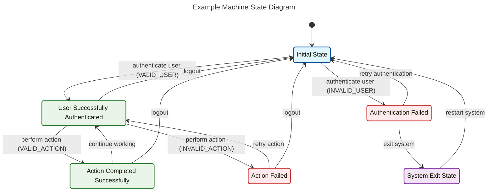

```mermaid
---
title: Example Machine State Diagram
---
stateDiagram-v2
    [*] --> Start
    
    Start --> Authenticated : authenticate user (VALID_USER)
    Start --> Failed : authenticate user (INVALID_USER)
    
    Authenticated --> Success : perform action (VALID_ACTION)
    Authenticated --> Error : perform action (INVALID_ACTION)
    Authenticated --> Start : logout
    
    Failed --> Start : retry authentication
    Failed --> End : exit system
    
    Success --> Authenticated : continue working
    Success --> Start : logout
    
    Error --> Authenticated : retry action
    Error --> Start : logout
    
    End --> Start : restart system
    
    %% State descriptions
    Start : Initial State
    Authenticated : User Successfully Authenticated
    Failed : Authentication Failed
    Success : Action Completed Successfully
    Error : Action Failed
    End : System Exit State
    
    %% Styling
    classDef startState fill:#e1f5fe,stroke:#01579b,stroke-width:2px
    classDef successState fill:#e8f5e8,stroke:#2e7d32,stroke-width:2px
    classDef errorState fill:#ffebee,stroke:#c62828,stroke-width:2px
    classDef endState fill:#f3e5f5,stroke:#7b1fa2,stroke-width:2px
    
    class Start startState
    class Authenticated,Success successState
    class Failed,Error errorState
    class End endState
```
